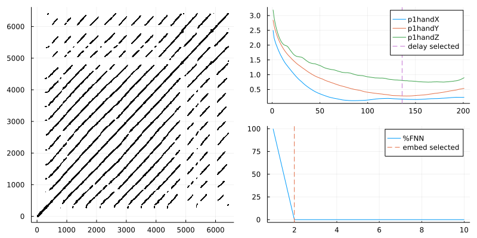
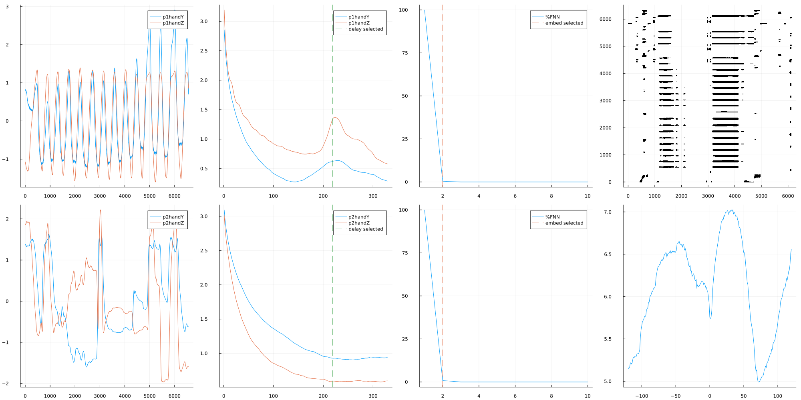

# md-recurrence-julia
multi-dimensional recurrence methods written in Julia. 

- Adapted from Wallot and Mønster (2018) "Calculation of Average Mutual Information (AMI) and False-Nearest Neighbors (FNN) for the Estimation of Embedding Parameters of Multidimensional Time Series in Matlab."  https://doi.org/10.3389/fpsyg.2018.01679
- credit to Dan Mønster: https://github.com/danm0nster/mdembedding and Sebastian Wallot (https://github.com/Wallot/MdRQA)

## Files

- **mdFnn.jl**: estimates false nearest neighbors function for multidimensional dataset
- **mdEmbed.jl** embeds multidimensional timeseries

- **example_mdRQA.jl**: example script for running md-RQA, uses:
  - **mdFnn.jl** for multi-dimensional estimate of embedding
  - **mdEmbed.jl** for multi-dimensional embedding
  - **DynamicalSystems.jl** for delay-embedding and recurrence analysis

- **example_mdCRQA.jl**: example script for running md-CRQA

- **exampleData.csv**: example input dataset. Contains hand position data for two participants in a joint task

- **rqa_output.csv**: example output data frame of md_RQAanalysis.
- **crqa_output.csv**: example output data frame of md_CRQAanalysis.

- **simple_diagnostic_plots_filename.png**: output of diagnositic plot. Contains:

  - plot of AMI funciton and estimated delay (mean value of all dimensions)
  - plot of FNN function and estimated embedding
  - recurrence plot

  

- **cross_rec_diagnostic_plots.png**: output of diagnositic plot for md-CRQA. Contains *for each timeseries*:
  - movement timeseries plots
  - plot of AMI funciton and estimated delay (mean value of all dimensions)
  - plot of FNN function and estimated embedding
  - cross recurrence plot
  - diagonal RR plot
  
  

